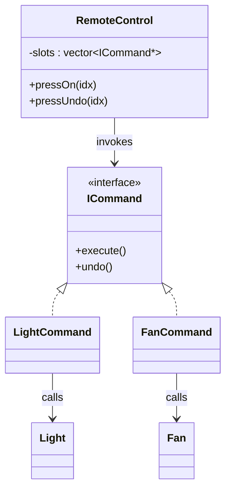

# Command Design Pattern – Remote Control Example

This example shows a remote control invoking `Light` and `Fan` actions via the Command pattern.

## Structure
- `ICommand` – command interface with `execute()`/`undo()`.
- `LightCommand`, `FanCommand` – concrete commands calling `Light::On/Off` and `Fan::On/Off`.
- `RemoteControl` – invoker holding command slots and toggling between execute/undo.
- Receivers: `Light`, `Fan`.

## Key Points
- `RemoteControl` uses a fixed slot count (`numButtons = 3`), bounds-checks indices, and cleans up owned commands in its destructor.
- Concrete commands own their receivers and delete them in their destructors (simple demo ownership). Swap to smart pointers for production.
- Output messages include newlines so log lines don’t run together.

## Build & Run
```bash
g++ -std=c++17 -Wall -Wextra -o command main.cpp
./command
```

## Expected Output
```
Simulating the light toggling
Light is turned ON
Light is turned OFF
Fan is turned ON
Fan is turned OFF
Invalid Press
```

## Possible Improvements
- Replace raw pointers with `std::unique_ptr` for safer ownership.
- Allow dynamic button count via constructor parameter.
- Add a command history stack to support multi-step undo/redo.

## UML

