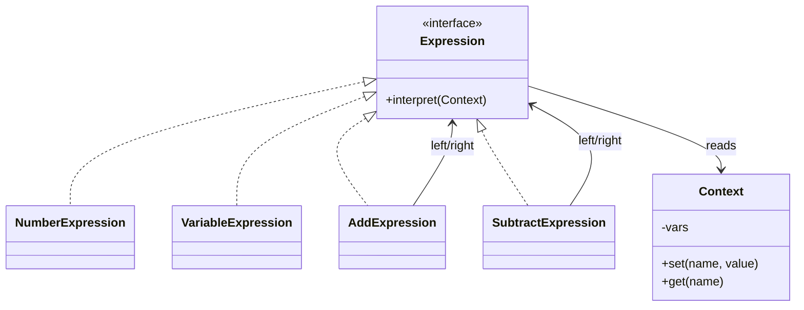

# Interpreter Design Pattern - Mini Expression Evaluator

Parses and evaluates simple arithmetic expressions with variables using an AST of expression objects.

## Components
- `Expression` interface with `interpret(Context&)`.
- Terminal expressions: `NumberExpression`, `VariableExpression`.
- Nonterminal expressions: `AddExpression`, `SubtractExpression` compose expressions recursively.
- `Context` stores variable bindings (`a`, `b`, etc.).

## Build & Run
```bash
cd Behavioral_Patterns/Interpreter_Design_Pattern
g++ -std=c++17 -Wall -Wextra -o interpreter main.cpp
./interpreter
```

## Expected Output
```
Expression: a + 3 - b
a = 10, b = 4
Result: 9
```

## Why Interpreter
- Encapsulates grammar rules in classes, enabling new operations (e.g., multiply/divide) by adding new expression nodes.
- Separates parsing/tokenizing from evaluation via the `Context` and AST.

## UML

