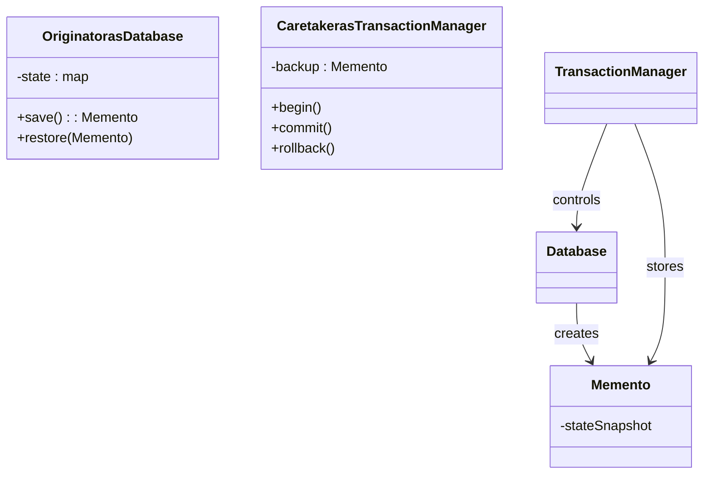

# Memento Design Pattern - DB Transaction

Save and restore database state around a transaction using mementos.

## Components
- `Memento` holds a snapshot of key/value data.
- `Database` (Originator) can `save()` to a memento and `restore()` from it.
- `TransactionManager` (Caretaker) owns the backup and controls `begin/commit/rollback`.

## Build & Run
```bash
cd Memento_Design_Pattern
g++ -std=c++17 -Wall -Wextra -o memento main.cpp
./memento
```

## Expected Output
```
DB: balance:1=100 user:1=Alice 
Begin transaction
DB: audit=failed balance:1=-50 user:1=Alice 
Rollback
DB: balance:1=100 user:1=Alice 
Begin transaction
DB: balance:1=120 user:1=Alice 
Commit
DB: balance:1=120 user:1=Alice 
```

## Why Memento
- Captures state before risky operations and restores on failure without exposing internal representation.
- Caretaker manages lifecycle of snapshots; originator focuses on state logic.

## UML

