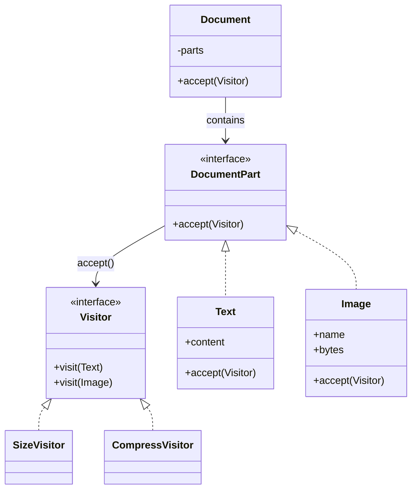

# Visitor Design Pattern - Document Reader

Adds new operations to document parts (text, images) without changing their classes by using visitors.

## Components
- Elements: `Text`, `Image` implement `accept(Visitor&)`.
- Visitors: `SizeVisitor` (accumulates bytes), `CompressVisitor` (prints compression steps).
- `Document` holds parts and forwards `accept`.

## Build & Run
```bash
cd Visitor_Design_Pattern
g++ -std=c++17 -Wall -Wextra -o visitor main.cpp
./visitor
```

## Expected Output
```
Total size: 12064 bytes
Compressing text to gzip: Design patterns...
Compressing image diagram.png (12000 bytes) to WebP.
Compressing text to gzip: Visitor lets yo...
```

## Why Visitor
- New operations (size, compress, export, spell-check) can be added as new visitors without editing `Text`/`Image`.
- Keeps data structures stable while behavior varies.

## UML

