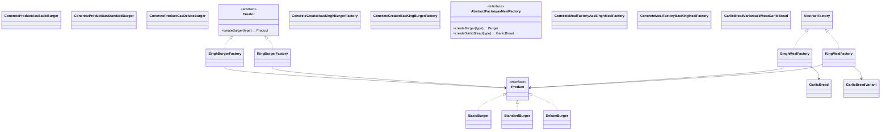

# Factory Design Pattern

## What is the Factory Pattern?
Factory patterns encapsulate object creation logic, so client code asks a factory for objects instead of instantiating concrete classes directly.

This improves:
- decoupling between client code and concrete implementations,
- maintainability when adding new product types,
- readability by centralizing creation rules.

## Implementations in this folder
This folder contains three related factory pattern examples:

1. `Simple_factory.cpp`
2. `Factory_Method.cpp`
3. `Abstract_Factory_Method.cpp`

## 1) Simple Factory (`Simple_factory.cpp`)
- Product interface: `Burger`
- Concrete products: `BasicBurger`, `StandardBurger`, `DeluxeBurger`
- Factory: `BurgerFactory::createBurger(string type)` (static method)

How it works:
- Client passes a type string (`basic`, `standard`, `deluxe`).
- Factory decides which concrete burger to create and returns `Burger*`.

Use case:
- Good for straightforward centralized creation logic.

## 2) Factory Method (`Factory_Method.cpp`)
- Product interface: `Burger`
- Concrete products:
  - Regular: `BasicBurger`, `StandardBurger`, `DeluxeBurger`
  - Wheat variants: `BasicWheatBurger`, `StandardWheatBurger`, `DeluxeWheatBurger`
- Creator interface: `BurgerFactory` with virtual `createBurger(string type)`
- Concrete creators:
  - `SinghBurgerFactory` (regular burgers)
  - `KingBurgerFactory` (wheat burgers)

How it works:
- Client chooses a factory family (`SinghBurgerFactory` or `KingBurgerFactory`).
- Selected factory creates the matching burger variant for the same type input.

Use case:
- Useful when different subclasses/factories produce different variants of a product.

## 3) Abstract Factory (`Abstract_Factory_Method.cpp`)
- Product families:
  - `Burger` hierarchy
  - `GarlicBread` hierarchy
- Abstract factory interface: `MealFactory`
  - `createBurger(string type)`
  - `createGarlicBread(string type)`
- Concrete factories:
  - `SinghMealFactory` (regular meal family)
  - `KingMealFactory` (wheat meal family)

How it works:
- One factory instance creates related product families that are consistent with each other (e.g., regular meal vs wheat meal).

Use case:
- Best when you need to create multiple related product types together with consistent variants.

## Summary
- `Simple Factory`: one factory class, one product family, conditional creation.
- `Factory Method`: abstract creator + concrete creators decide product variant.
- `Abstract Factory`: factory for multiple related product families.

## UML

