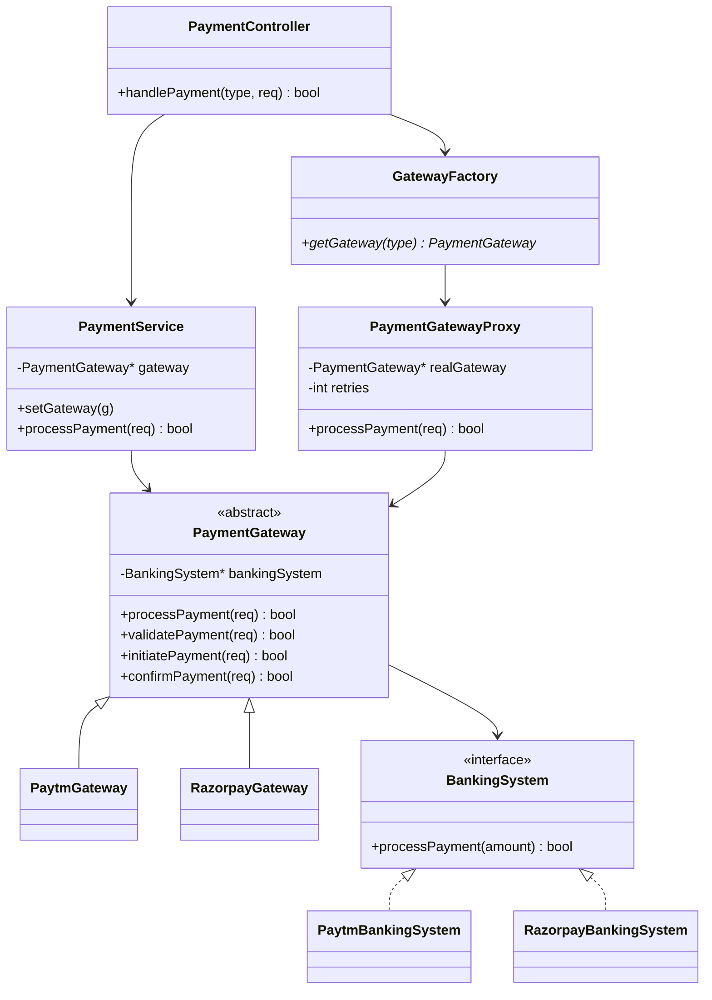

# Payment Gateway System (C++ demo)

This repo now contains two complementary implementations:
1) **Current user version (controller + factory + proxy, Template Method for flow)** – main.cpp (current).  
2) **Earlier facade/registry version (multi-provider adapters with pluggable retry strategies)** – kept below for reference/extension ideas.

## Current implementation (user version)
- **Patterns**: Template Method (`PaymentGateway::processPayment`), Proxy (`PaymentGatewayProxy` adds retries), Factory + Singleton (`GatewayFactory`, `PaymentService`, `PaymentController`), Strategy (`BankingSystem` implementations per provider).
- **Gateways**: `PaytmGateway`, `RazorpayGateway` each owning a `BankingSystem` (Paytm/Razorpay).  
- **Flow**:
  1. Client calls `PaymentController::handlePayment(type, request)`.
  2. `GatewayFactory` returns a concrete gateway wrapped in `PaymentGatewayProxy` (with provider-specific retry count).
  3. `PaymentService` sets the gateway and invokes the Template Method: validate → initiate (calls `BankingSystem::processPayment`) → confirm.
  4. Proxy retries on failure up to configured attempts.
- **Simulation**: Randomized success per provider, basic currency/amount validation, no refunds in this version.

## Previous façade-based design (reference/extension)
- **Components**: `PaymentGatewayFacade`, `ProviderRegistry`, `PaymentProvider` adapters (Paytm, Razorpay, PayPal), `RetryStrategy` (linear/exponential), `PaymentValidator`.
- **Capabilities**: Multi-provider routing by name, idempotency validation, retries on network/5xx, refunds via adapters.
- **Why keep it**: Provides a path to add refunds, idempotency keys, and normalized error handling on top of the current implementation if needed.

## UML (current implementation)


## Running
From `Payment_Gateway_System/`:
```bash
g++ -std=c++17 main.cpp -o main
./main
```
You’ll see Paytm and Razorpay runs with proxy retries applied (Paytm up to 3, Razorpay up to 1).

## Ratings (quick eval)
- **Current user version**: 7.5/10 — Clear use of Template Method + Proxy + Factory + Singleton; easy gateway swap. Could improve by adding refunds, idempotency, normalized error mapping, and removing raw `new`/manual deletes (use smart pointers).
- **Facade/registry version**: 8.0/10 — Adds normalized adapter interface, configurable retry policies, and refunds; more extensible for new providers. Needs persistence, webhooks, and security hardening to be production-ready.

## Suggested next steps
- Merge the best of both: keep the Template Method for flow but use provider registry + pluggable retry policies; add refund support and idempotency.
- Replace manual memory management with `unique_ptr`/`shared_ptr`.
- Add exponential/linear backoff choice per provider and a simple in-memory idempotency cache for demos.
