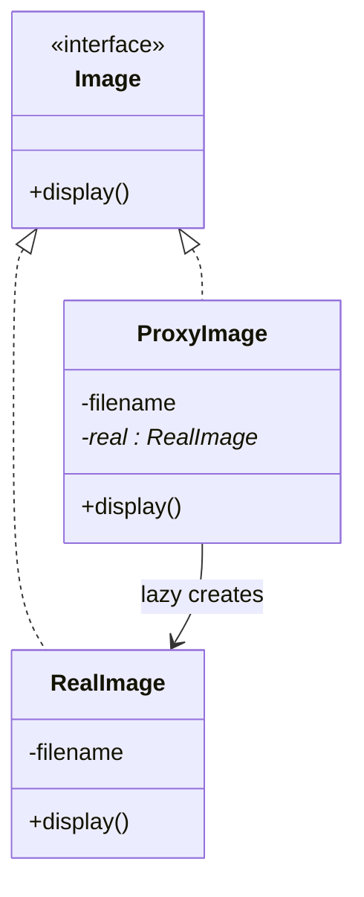

# Proxy Design Pattern – Lazy Image Loader (C++)

Demonstrates a virtual proxy that defers expensive image loading until it’s actually displayed, then caches the real object.

## Classes
- `Image` – subject interface.
- `RealImage` – loads from disk on first display and renders.
- `ProxyImage` – holds filename, creates `RealImage` lazily, reuses it for subsequent calls.

## Running
From `Proxy_Design_Pattern/`:
```bash
g++ -std=c++17 main.cpp -o main
./main
```
You’ll see the first display trigger a heavy load; the second reuse the cached instance.

## When to use
- Lazy-loading large assets (images, configs).
- Access control or request throttling layers that sit in front of real services.
- Remote proxies that hide network calls behind a local interface.

## UML

